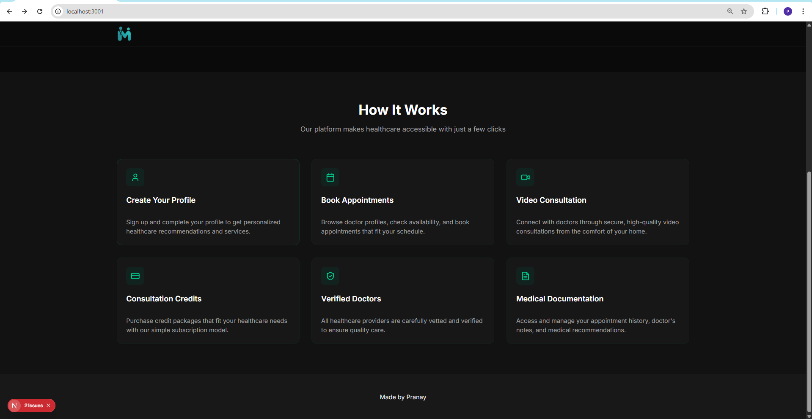
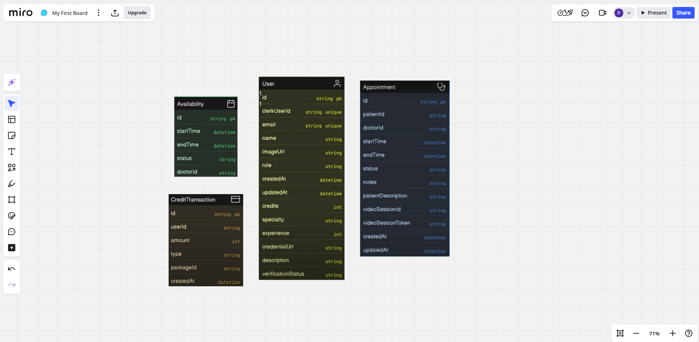
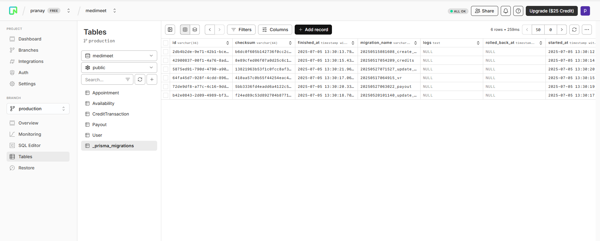
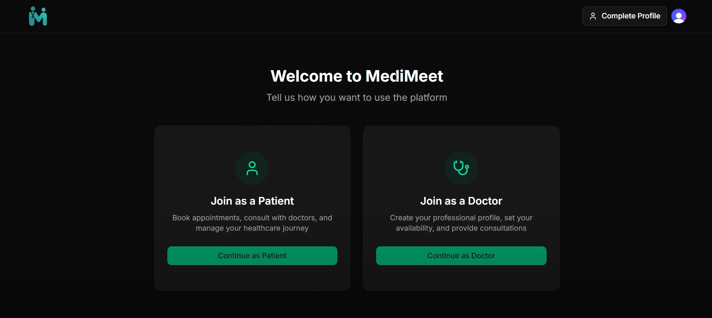

# MediMeet – Full Stack Doctor's Appointment App

A modern, full-stack telemedicine platform where users can register as patients or doctors, book real-time consultations, and conduct 1-on-1 video calls — all through a clean and responsive interface. Built with **Next.js**, **Clerk**, **Neon DB**, and **Prisma**.

## What’s Inside

### Authentication & Roles
- Role-based sign up/login using **Clerk**
- Seamless onboarding for:
  - Patients
  - Doctors
  - Admins
- Secure session management
- Dynamic routing and dashboard redirection

### Patient Features
- Browse doctors by specialty
- View profiles and book appointments based on real-time availability
- Manage and cancel appointments
- Purchase monthly subscription plans when out of credits

### Doctor Features
- Apply to join as a verified doctor with medical credentials
- Set weekly availability for appointments
- View consultation earnings and request withdrawals

### Admin Dashboard
- Approve/reject doctor applications
- Verify submitted credentials
- Process doctor withdrawal requests


## Tech Stack
| Layer         | Tech Used                             |
|---------------|----------------------------------------|
| Frontend      | Next.js (App Router), Tailwind CSS, ShadCN UI |
| Auth          | Clerk (role-based access)              |
| Database      | Neon Postgres (serverless)             |
| ORM           | Prisma                                 |
| UI Components | ShadCN UI                              |
| Fonts         | Inter (`@next/font/google`)            |
| Styling       | Tailwind CSS                           |
| Tooling       | ESLint, Turbopack                      |


# Run the development server
- npm lite-server             
- npm install @clerk/nextjs
- npx prisma init --db --output ../app/generated/prisma
- npx prisma generate
- npm run dev

# Folder Structure 
```
.
├── app/                        # App directory
│   ├── (auth)/                # Auth-related routes (e.g. sign-in, sign-up)
│   ├── (main)/                # Main app routes
│   │   ├── admin/             # Admin dashboard pages
│   │   ├── appointments/      # Appointments booking & management
│   │   ├── doctor/            # Doctor-specific routes
│   │   ├── doctors/           # Doctors listing and profiles
│   │   ├── onboarding/        # New user onboarding flow
│   │   ├── pricing/           # Pricing information
│   ├── layout.jsx             # App-wide layout component
│   ├── page.js                # Rote landing page
│
├── components/                # Shared React components
│   ├── ui/                    # UI primitives (reusable) Shadcn
│   │   ├── alert.jsx
│   │   ├── badge.jsx
│   │   ├── button.jsx
│   │   ├── card.jsx
│   │   ├── dialog.jsx
│   │   ├── input.jsx
│   │   ├── label.jsx
│   │   ├── select.jsx
│   │   ├── separator.jsx
│   │   ├── sonner.jsx
│   │   ├── tabs.jsx
│   │   └── textarea.jsx
│   ├── appointment-card.jsx  # Appointment display card
│   ├── header.jsx            # Top navigation
│   ├── page-header.jsx       # Page title + breadcrumb
│   ├── pricing.jsx           # Pricing section component
│   └── theme-provider.jsx    # Theme provider (Shadcn)
│
├── hooks/                    # Custom React hooks
│
├── lib/                      # Server-side utilities & DB logic
│   ├── checkUser.js          # Middleware for auth/role check
│   ├── data.js               # Static/shared data
│   ├── prisma.js             # Prisma client setup
│   ├── private.key           # Prisma private key
│   ├── schema.js             # Data validation schemas
│   ├── specialities.js       # Medical specialties data/config
│   └── utils.js              # Miscellaneous utility functions
│
├── prisma/                   # Prisma schema and migrations
│   ├── migrations/           # Auto-generated DB migration files
│   ├── schema.prisma         # Main Prisma schema
│   └── migration_lock.toml   # Prisma lock file
│
├── public/                   # Static files (images, logos, etc.)
│   ├── banner.png
│   ├── logo.png
│   └── logo-single.png
│
├── .clerk/                   # Clerk config (auth provider)
├── .next/                    # Next.js build folder
├── .eslintrc                 # ESLint config
├── jsconfig.json             # JS path alias config
├── middleware.js             # Edge middleware for auth/protection
├── next.config.mjs           # Next.js config
└── README.md

```

# Sharing few Screenshots of work

### Started with home page the landing page 


### Features


### Pricing


### DB Models 


### Neon DB console



## Adding onboarding component


## Doctor Dashboard


